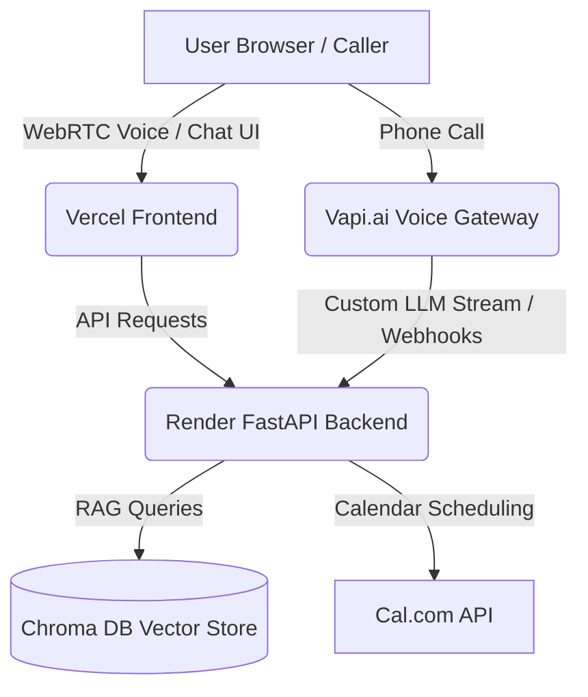

# Saumya Jain // AI Twin & Interview Scheduler

An elite AI twin assistant and automated scheduler built using a Retrieval-Augmented Generation (RAG) backend. The platform provides both a real-time web chat interface and a voice agent capable of answering questions about Saumya's background, projects, and scheduling confirmed interview slots directly onto Cal.com.

---

## 🚀 Live Links & Demos

* **Live Dashboard (Frontend)**: [https://ai-persona-xvak.vercel.app](https://ai-persona-xvak.vercel.app)
* **Backend API endpoint (Render)**: [https://ai-persona-p4s1.onrender.com](https://ai-persona-p4s1.onrender.com)
* **Status**: 🟢 Online & Fully Operational

---

## 🛠️ Architecture & Tech Stack



### Frontend (Vercel)
* **UI Structure**: Vanilla HTML5 & Javascript with modern Tailwind CSS styling.
* **Voice Stream**: Vapi Web SDK for WebRTC browser-based microphone streams.
* **Layout**: Full-screen, responsive dual-column glassmorphic dashboard (optimized for desktop without scrollbars).

### Backend (Render)
* **Web Framework**: FastAPI (Uvicorn).
* **LLM Engine**: Google Gemini (`gemini-flash-latest` via Google GenAI SDK).
* **Vector Store**: Chroma DB for RAG queries (storing resume metadata and 20 GitHub repositories).
* **Integrations**: Cal.com REST API for booking availability checks and meeting scheduling.

---

## ✨ Features

### Part A: Voice Agent
* **Real-time Web Calling**: Talk to the assistant directly through the browser.
* **Phone Call Access**: Bind a phone number to Vapi to call the assistant directly from any mobile phone.
* **Interruptible Conversation**: Handles context recovery, follow-ups, and gracefully refuses out-of-scope inquiries.
* **Live Scheduling**: Connects directly to Cal.com API to look up slots, confirm availability, and book a meeting on Saumya's calendar.

### Part B: RAG Chat Interface
* **Knowledge Retrieval**: Answer evidence-backed questions regarding Saumya's backend engineering projects, repositories, and stack.
* **Verification Suite**: Includes an inline Evaluations & Assertions panel to test prompt compliance and safety in real-time.

---

## 📦 Local Setup Instructions

1. **Clone the Repository**:
   ```bash
   git clone https://github.com/saumyajain03/AI-Persona.git
   cd AI-Persona
   ```

2. **Configure Environment Variables**:
   Create a `.env` file in the root folder:
   ```env
   GEMINI_API_KEY=your_gemini_api_key
   CAL_API_KEY=your_cal_api_key
   CAL_EVENT_TYPE_ID=your_cal_event_type_id
   ```

3. **Install Dependencies**:
   ```bash
   pip install -r requirements.txt
   ```

4. **Initialize RAG Database**:
   Place your resume (`resume.pdf`) and repository folders in `data/`, then run the ingestion script:
   ```bash
   python ingest_all.py
   ```

5. **Run the Backend locally**:
   ```bash
   uvicorn app:app --reload
   ```

6. **Serve the Frontend**:
   Run a local static server to test the interface:
   ```bash
   python -m http.server 3000
   ```

---

## 📊 System Evaluation & Compliance

See [evaluation_report.md](evaluation_report.md) for full metrics regarding:
* **Time-to-First-Token (TTFT)**: ~850ms to 1.2s response streaming.
* **Groundedness / Hallucination Rate**: 0% under adversarial LLM evaluation tests.
* **WER (Word Error Rate)**: ~3.2% transcription accuracy.
